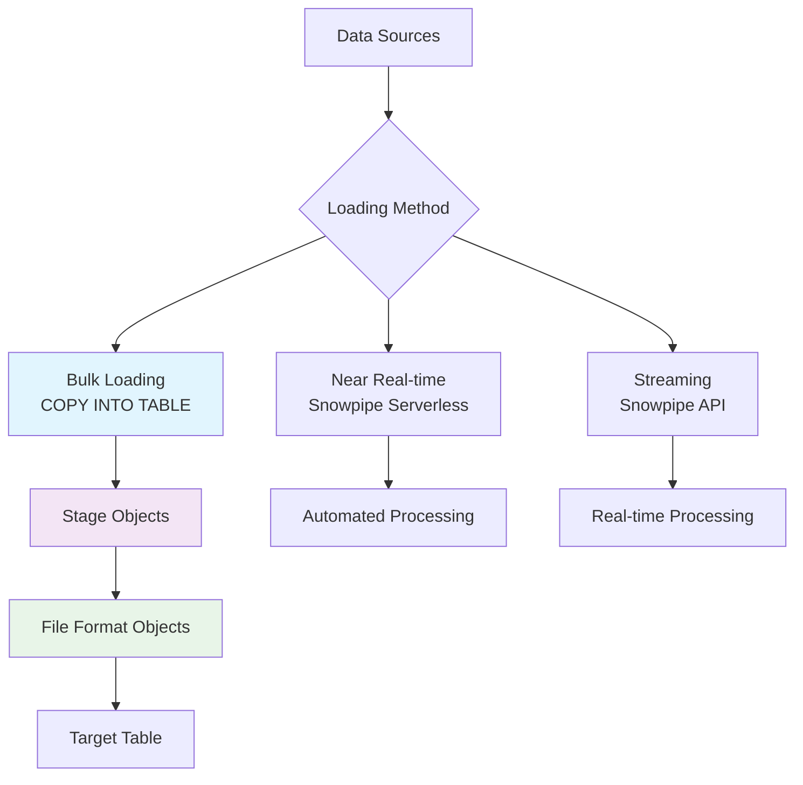
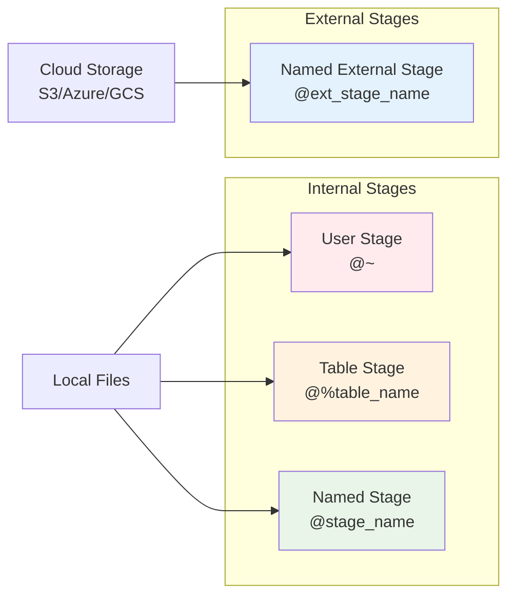
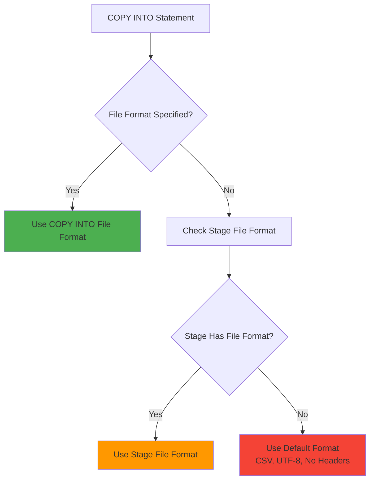
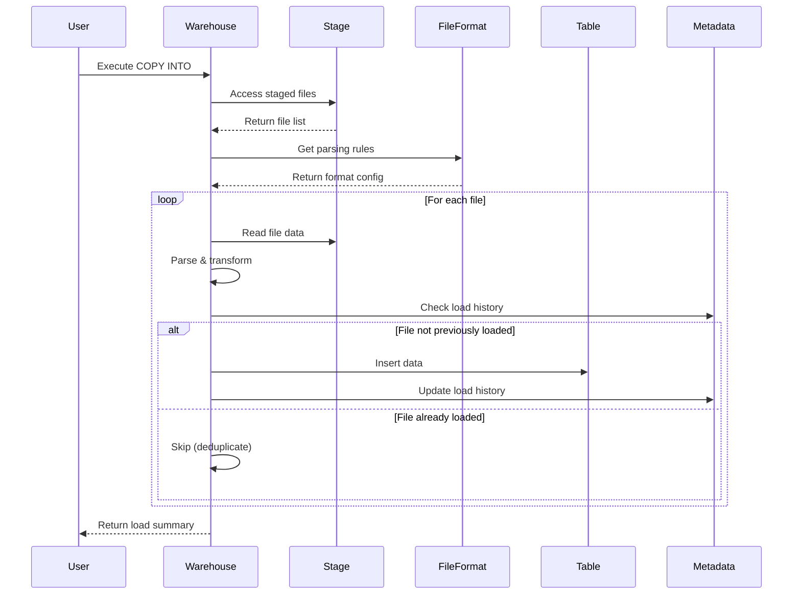
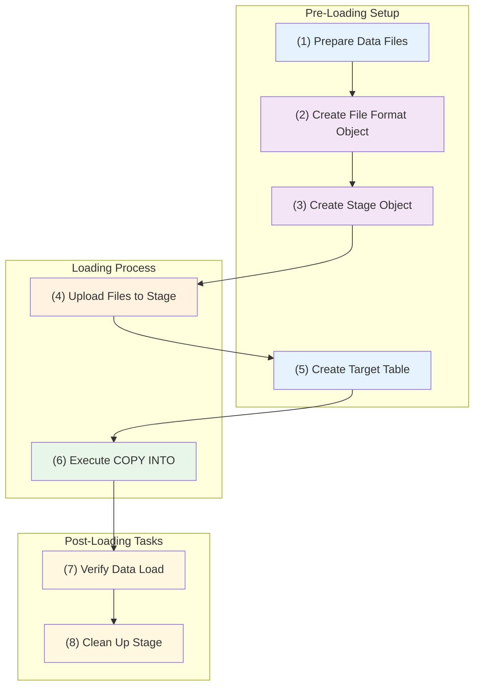

# Snowflake Data Loading and Stage Objects - Comprehensive Reference

## Table of Contents
1. [Overview](#overview)
2. [Core Concepts and Terminology](#core-concepts-and-terminology)
3. [Data Loading Methods](#data-loading-methods)
4. [Stage Objects](#stage-objects)
5. [File Format Objects](#file-format-objects)
6. [COPY INTO TABLE Statement](#copy-into-table-statement)
7. [Complete Workflow](#complete-workflow)
8. [Practical Implementation](#practical-implementation)
9. [Best Practices](#best-practices)

## Overview

Snowflake's data loading architecture is designed to handle big data processing and analysis of millions of rows from multiple sources. Unlike traditional databases that rely heavily on INSERT statements, Snowflake provides specialized bulk loading mechanisms that are optimized for large-scale data operations.

## Core Concepts and Terminology

### Key Terms and Distinctions

#### **Stage vs. Table vs. Warehouse**
- **Stage**: A temporary storage location for raw data files before loading into tables. Think of it as a staging area or landing zone.
- **Table**: The final destination where structured data is stored in Snowflake's columnar format for querying.
- **Warehouse**: The compute resource (virtual warehouse) required to execute the COPY INTO operation.

#### **Internal vs. External Stages**
- **Internal Stages**: Storage provisioned and managed by Snowflake within the platform
- **External Stages**: Cloud storage areas (like S3 buckets) outside Snowflake, managed by users

#### **Bulk Loading vs. Streaming vs. Near Real-time**
- **Bulk Loading**: Large batch operations using COPY INTO TABLE for historical data loads
- **Streaming**: Real-time data ingestion using Snowpipe API (e.g., from Apache Kafka)
- **Near Real-time**: Small batch processing using serverless Snowpipe feature

#### **Normalized vs. Denormalized Data Models**
- **Normalized**: Traditional OLTP approach with data split across multiple related tables
- **Denormalized**: Data warehouse approach with consolidated data in fewer tables for complex analytical queries

## Data Loading Methods

Snowflake provides three primary methods for data ingestion:



### 1. Bulk Loading (Focus of this document)
- Uses COPY INTO TABLE statement
- Ideal for large datasets and batch processing
- Requires manual execution or scheduling
- Best for historical data loads and periodic updates

### 2. Near Real-time Loading (Snowpipe)
- Serverless feature for small batch processing
- Automatically triggered when files arrive in stage
- Ideal for continuous data ingestion

### 3. Streaming (Snowpipe API)
- Real-time data streaming from sources like Apache Kafka
- Continuous data flow without staging files
- Used for real-time analytics scenarios

## Stage Objects

### Stage Object Architecture



### Internal Stage Types

#### **User Stage (@~)**
- **Purpose**: Private staging area for individual users
- **Scope**: Single user access
- **Auto-provisioned**: Yes, for every user account
- **Use Case**: Personal data loading operations
- **Access Pattern**: `@~[/path]`

#### **Table Stage (@%table_name)**
- **Purpose**: Shared staging area tied to specific table
- **Scope**: Multiple users, single table destination
- **Auto-provisioned**: Yes, for every table
- **Use Case**: Collaborative loading into specific tables
- **Access Pattern**: `@%table_name[/path]`

#### **Named Stage (@stage_name)**
- **Purpose**: Flexible staging area for any user/table combination
- **Scope**: Configurable access, multiple tables
- **Auto-provisioned**: No, must be created explicitly
- **Use Case**: Enterprise data loading workflows
- **Access Pattern**: `@stage_name[/path]`

### Stage Creation and Configuration

```sql
-- Basic Named Stage Creation
CREATE STAGE stage_name;

-- Advanced Stage with Configuration
CREATE STAGE advanced_stage
  FILE_FORMAT = (
    TYPE = CSV
    FIELD_DELIMITER = ','
    SKIP_HEADER = 1
  )
  COPY_OPTIONS = (
    ON_ERROR = 'CONTINUE'
    PURGE = TRUE
  )
  ENCRYPTION = (TYPE = 'SNOWFLAKE_SSE');
```

### Stage Management Commands

#### **LIST Command**
```sql
-- List all files in stage
LIST @stage_name;

-- List files in specific directory
LIST @stage_name/directory_path;
```

**Output includes:**
- File path within stage
- File size in bytes
- File hash (for integrity verification)
- Last modified timestamp

#### **QUERY Command**
```sql
-- Query stage files directly
SELECT $1, $2, $3 
FROM @stage_name/file.csv;

-- Query with metadata
SELECT 
    $1 as column1,
    $2 as column2,
    metadata$filename,
    metadata$file_row_number
FROM @stage_name;
```

#### **REMOVE Command**
```sql
-- Remove specific file
REMOVE @stage_name/file.csv;

-- Remove all files in directory
REMOVE @stage_name/directory_path/;
```

### File Upload Methods

#### **1. SnowSQL Command Line (PUT)**
```bash
# Upload single file
PUT file:///local/path/data.csv @stage_name;

# Upload with options
PUT file:///local/path/data.csv @stage_name 
  AUTO_COMPRESS = FALSE
  OVERWRITE = TRUE;
```

#### **2. Web UI Upload**
- Navigate to **Data** → **Add Data** → **Load files into a stage**
- Select target database, schema, and stage
- Browse and upload files
- Automatic encryption applied

## File Format Objects

### Purpose and Scope

File Format objects serve as configuration templates that define how Snowflake should interpret and parse different file types during the loading process. They act as a bridge between raw file data and structured table data.

### File Format Hierarchy and Precedence



### Supported File Types

| Format | Extension | Description | Use Cases |
|--------|-----------|-------------|-----------|
| **CSV** | .csv, .txt | Comma-delimited flat files | Structured tabular data |
| **JSON** | .json | JavaScript Object Notation | Semi-structured data, APIs |
| **Avro** | .avro | Binary serialization format | Schema evolution, Hadoop ecosystem |
| **ORC** | .orc | Optimized Row Columnar | Hive, big data analytics |
| **Parquet** | .parquet | Columnar storage format | Analytics, compression efficiency |
| **XML** | .xml | Extensible Markup Language | Legacy systems, document data |

### CSV File Format Configuration

```sql
CREATE OR REPLACE FILE FORMAT csv_format
  TYPE = CSV
  FIELD_DELIMITER = ','           -- Column separator
  RECORD_DELIMITER = '\n'         -- Row separator  
  SKIP_HEADER = 1                 -- Skip header row
  NULL_IF = ('NULL', 'null', '')  -- Null value representations
  EMPTY_FIELD_AS_NULL = TRUE      -- Treat empty fields as NULL
  FIELD_OPTIONALLY_ENCLOSED_BY = '"'  -- Quote character
  ESCAPE_UNENCLOSED_FIELD = '\\'  -- Escape character
  DATE_FORMAT = 'DD/MM/YYYY'      -- Date parsing format
  TIME_FORMAT = 'HH24:MI:SS'      -- Time parsing format
  TIMESTAMP_FORMAT = 'DD/MM/YYYY HH24:MI:SS'  -- Timestamp format
  COMPRESSION = 'GZIP'            -- File compression type
  ENCODING = 'UTF8';              -- Character encoding
```

### Key File Format Properties

#### **Delimiter Configuration**
- **FIELD_DELIMITER**: Specifies character(s) separating columns (comma, pipe, tab)
- **RECORD_DELIMITER**: Defines row separation (newline, carriage return)

#### **Header and Data Handling**
- **SKIP_HEADER**: Number of rows to skip at file beginning
- **NULL_IF**: Array of strings to interpret as NULL values
- **EMPTY_FIELD_AS_NULL**: Treats empty fields as NULL rather than empty strings

#### **Text Qualifiers**
- **FIELD_OPTIONALLY_ENCLOSED_BY**: Quote character for text fields
- **ESCAPE_UNENCLOSED_FIELD**: Escape character for special characters

#### **Date and Time Parsing**
- **DATE_FORMAT**: Pattern for date field interpretation
- **TIME_FORMAT**: Pattern for time field parsing  
- **TIMESTAMP_FORMAT**: Combined date-time pattern

#### **File Properties**
- **COMPRESSION**: Supported formats (GZIP, BZIP2, DEFLATE, etc.)
- **ENCODING**: Character encoding (UTF-8, ISO-8859-1, etc.)

## COPY INTO TABLE Statement

### Statement Architecture

The COPY INTO TABLE statement is the core mechanism for transferring data from stages to tables. It orchestrates the entire loading process including file parsing, data transformation, and error handling.



### Basic Syntax and Examples

#### **Simple Copy Operation**
```sql
-- Copy all files from stage
COPY INTO movie_table FROM @movie_stage;

-- Copy specific file
COPY INTO movie_table FROM @movie_stage/data.csv;

-- Copy with file pattern
COPY INTO movie_table FROM @movie_stage
  PATTERN = '.*movies.*\.csv';
```

#### **Copy with File Format**
```sql
-- Using named file format
COPY INTO movie_table FROM @movie_stage
  FILE_FORMAT = (FORMAT_NAME = 'csv_format');

-- Inline file format options
COPY INTO movie_table FROM @movie_stage
  FILE_FORMAT = (
    TYPE = CSV
    SKIP_HEADER = 1
    FIELD_DELIMITER = ','
  );
```

### Advanced Configuration Options

#### **File Selection Options**
```sql
COPY INTO movie_table FROM @movie_stage
  FILES = ('file1.csv', 'file2.csv')     -- Specific files
  PATTERN = '.*\.csv'                    -- Regex pattern
  FILE_FORMAT = (FORMAT_NAME = 'csv_format');
```

#### **Error Handling Options**
```sql
COPY INTO movie_table FROM @movie_stage
  ON_ERROR = 'CONTINUE'                  -- Continue on errors
  -- ON_ERROR = 'SKIP_FILE'              -- Skip entire file on error
  -- ON_ERROR = 'ABORT_STATEMENT'        -- Abort on first error (default)
  RETURN_FAILED_ONLY = TRUE              -- Return only failed records
  MAX_FILE_SIZE = 1000000000;            -- Max file size in bytes
```

#### **Post-Load Options**
```sql
COPY INTO movie_table FROM @movie_stage
  PURGE = TRUE                           -- Remove files after successful load
  FORCE = FALSE                          -- Respect load history (default)
  VALIDATION_MODE = 'RETURN_ERRORS';     -- Validate without loading
```

### Load History and Deduplication

Snowflake maintains load history metadata for 64 days to prevent duplicate loading:

- **File Identification**: Based on file name, size, and content hash
- **Automatic Deduplication**: Files with identical signatures are skipped
- **Force Override**: Use `FORCE = TRUE` to bypass deduplication
- **History Cleanup**: Metadata automatically purged after 64 days

### Error Handling Strategies

| Option | Behavior | Use Case |
|--------|----------|----------|
| **ABORT_STATEMENT** | Stop on first error (default) | Critical data loads requiring 100% success |
| **CONTINUE** | Skip invalid records, continue processing | Data quality issues expected |
| **SKIP_FILE** | Skip entire file containing errors | File-level quality control |

### Validation Mode

```sql
-- Validate files without loading
COPY INTO movie_table FROM @movie_stage
  VALIDATION_MODE = 'RETURN_ERRORS';

-- Return sample of rows that would be loaded
COPY INTO movie_table FROM @movie_stage
  VALIDATION_MODE = 'RETURN_10_ROWS';
```

## Complete Workflow

### End-to-End Data Loading Process



### Detailed Workflow Steps

#### **Step 1: Prepare Data Files**
- Ensure data quality and consistency
- Apply appropriate compression (recommended)
- Organize files in logical directory structures
- Document data schemas and formats

#### **Step 2: Create File Format Object**
```sql
CREATE OR REPLACE FILE FORMAT movie_csv_format
  TYPE = CSV
  FIELD_DELIMITER = ','
  SKIP_HEADER = 1
  NULL_IF = ('NULL', 'null')
  EMPTY_FIELD_AS_NULL = TRUE
  FIELD_OPTIONALLY_ENCLOSED_BY = '"'
  DATE_FORMAT = 'DD/MM/YYYY';
```

#### **Step 3: Create Stage Object**
```sql
CREATE OR REPLACE STAGE movie_stage
  FILE_FORMAT = movie_csv_format
  COPY_OPTIONS = (
    ON_ERROR = 'CONTINUE'
    PURGE = TRUE
  );
```

#### **Step 4: Upload Files to Stage**
```sql
-- Using SnowSQL
PUT file:///local/path/movies.csv @movie_stage;

-- Verify upload
LIST @movie_stage;
```

#### **Step 5: Create Target Table**
```sql
CREATE OR REPLACE TABLE movie (
    movie_id STRING NOT NULL,
    title STRING,
    genre STRING,
    description STRING,
    director_name STRING,
    actors STRING,
    release_date DATE,
    runtime NUMBER(3,0),
    rating NUMBER(3,1),
    gross NUMBER
);
```

#### **Step 6: Execute COPY INTO**
```sql
COPY INTO movie FROM @movie_stage;
```

#### **Step 7: Verify Data Load**
```sql
-- Check row count
SELECT COUNT(*) FROM movie;

-- Sample data verification
SELECT * FROM movie LIMIT 10;

-- Check for any load errors
SELECT * FROM TABLE(VALIDATE(movie, JOB_ID => '<job_id>'));
```

#### **Step 8: Clean Up Stage (if not using PURGE)**
```sql
REMOVE @movie_stage;
```

## Practical Implementation

### Real-World Example: Movie Database Loading

Based on the course materials, here's a complete implementation example:

```sql
-- Set context
USE ROLE SYSADMIN;
USE SCHEMA DEMO_DB.DEMO_SCHEMA;
USE WAREHOUSE XSMALL_WAREHOUSE;

-- 1. Create File Format for CSV files
CREATE OR REPLACE FILE FORMAT CSV_FILE_FORMAT
  TYPE = CSV
  FIELD_DELIMITER = ','
  SKIP_HEADER = 1
  NULL_IF = ('NULL', 'null')
  EMPTY_FIELD_AS_NULL = TRUE
  FIELD_OPTIONALLY_ENCLOSED_BY = '"'
  DATE_FORMAT = 'DD/MM/YYYY';

-- 2. Create Named Stage
CREATE OR REPLACE STAGE MOVIE_STAGE
  FILE_FORMAT = CSV_FILE_FORMAT;

-- 3. Create Target Table
CREATE OR REPLACE TABLE MOVIE (
    MOVIE_ID STRING NOT NULL, 
    TITLE STRING,
    GENRE STRING, 
    DESCRIPTION STRING, 
    DIRECTOR_NAME STRING, 
    ACTORS STRING, 
    RELEASE_DATE DATE, 
    RUNTIME NUMBER(3,0),
    RATING NUMBER(3,1),
    GROSS NUMBER
);

-- 4. Upload file (command line example)
-- PUT file:///Users/Admin/Downloads/imdb_movies.csv @MOVIE_STAGE AUTO_COMPRESS = FALSE;

-- 5. Verify stage contents
LIST @MOVIE_STAGE;

-- 6. Load data into table
COPY INTO MOVIE FROM @MOVIE_STAGE;

-- 7. Verify loaded data
SELECT * FROM MOVIE LIMIT 5;
SELECT COUNT(*) FROM MOVIE;
```

### Data Model Considerations

#### **Denormalized Design for Analytics**
The movie table example demonstrates a denormalized approach typical in data warehouses:

- **Single Table Structure**: All movie information in one table
- **Optimized for Reads**: Complex analytical queries benefit from fewer JOINs
- **Storage Trade-off**: Higher storage usage but better query performance
- **Maintenance Simplicity**: Easier to understand and maintain than highly normalized structures

#### **Data Type Selection**
- **STRING vs VARCHAR**: STRING recommended for variable-length text
- **NUMBER(precision, scale)**: Explicit precision for numeric data
- **DATE vs TIMESTAMP**: Choose based on time granularity needs

## Best Practices

### File Organization and Preparation

#### **File Size Optimization**
- **Recommended Size**: 100-250 MB compressed files
- **Avoid**: Very small files (< 1 MB) or very large files (> 5 GB)
- **Compression**: Always compress files before staging (GZIP recommended)
- **Partitioning**: Split large datasets across multiple files

#### **File Naming Conventions**
```
Format: {dataset}_{date}_{sequence}.{extension}
Example: movies_20231215_001.csv.gz
Benefits: 
- Easy sorting and organization
- Clear date identification
- Sequence tracking for ordering
```

### Performance Optimization

#### **Virtual Warehouse Sizing**
- **Small Loads**: X-Small warehouse sufficient
- **Large Loads**: Scale up warehouse size for parallel processing
- **Multiple Files**: Snowflake automatically parallelizes across files
- **Auto-Suspend**: Configure warehouses to suspend when idle

#### **Stage Management**
```sql
-- Regular cleanup of old files
REMOVE @stage_name/older_than_30_days/;

-- Monitor stage usage
SELECT 
    stage_name,
    SUM(size_bytes) as total_size,
    COUNT(*) as file_count
FROM TABLE(RESULT_SCAN(LAST_QUERY_ID()))
GROUP BY stage_name;
```

### Error Handling and Monitoring

#### **Load Monitoring**
```sql
-- Check recent copy operations
SELECT *
FROM TABLE(INFORMATION_SCHEMA.COPY_HISTORY(
    TABLE_NAME => 'MOVIE',
    START_TIME => DATEADD(hour, -24, CURRENT_TIMESTAMP())
));

-- Monitor load performance
SELECT 
    table_name,
    file_name,
    file_size,
    row_count,
    row_parsed,
    first_error_message
FROM TABLE(INFORMATION_SCHEMA.COPY_HISTORY())
WHERE execution_status = 'LOAD_FAILED';
```

#### **Error Recovery Strategies**
1. **Data Quality Issues**: Use `ON_ERROR = 'CONTINUE'` with error logging
2. **File Format Problems**: Validate with `VALIDATION_MODE` before loading
3. **Schema Mismatches**: Use `SELECT` from stage to inspect data structure
4. **Performance Issues**: Monitor warehouse utilization and scale accordingly

### Security Considerations

#### **Access Control**
```sql
-- Grant stage access to specific roles
GRANT USAGE ON STAGE movie_stage TO ROLE data_loader;
GRANT READ ON STAGE movie_stage TO ROLE data_analyst;

-- Limit table access
GRANT INSERT ON TABLE movie TO ROLE data_loader;
GRANT SELECT ON TABLE movie TO ROLE data_analyst;
```

#### **Data Encryption**
- **In Transit**: Automatic encryption for all data transfers
- **At Rest**: Snowflake-managed encryption by default
- **Customer-Managed**: Option for customer-provided encryption keys
- **External Stages**: Configure encryption at cloud storage level

### Change Management

#### **Schema Evolution**
```sql
-- Add new columns to existing table
ALTER TABLE movie ADD COLUMN budget NUMBER;

-- Handle missing columns in new files
COPY INTO movie (movie_id, title, genre, release_date)
FROM (
    SELECT $1, $2, $3, $5
    FROM @movie_stage/new_format_files/
);
```

#### **Version Control**
- Maintain file format objects in version control
- Document schema changes and migration scripts
- Test loading processes in development environments
- Implement rollback procedures for failed loads

This comprehensive reference provides a complete understanding of Snowflake's data loading mechanisms, from basic concepts to advanced implementation strategies. The workflow-oriented approach ensures practical applicability while the detailed technical explanations support both learning and troubleshooting scenarios.
