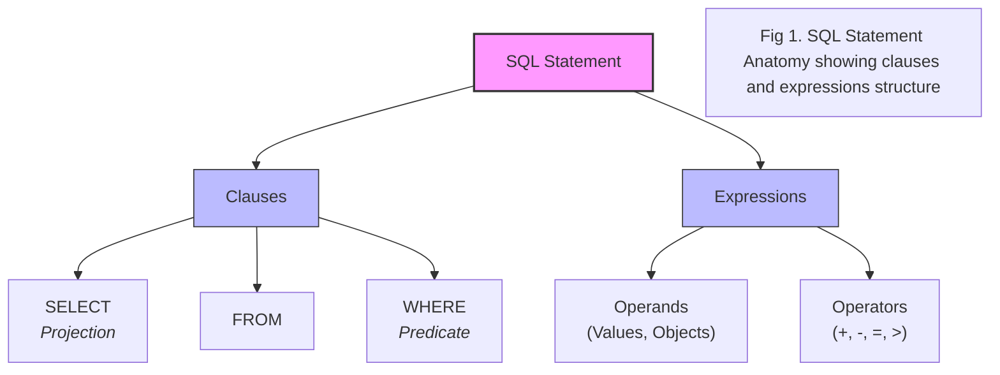
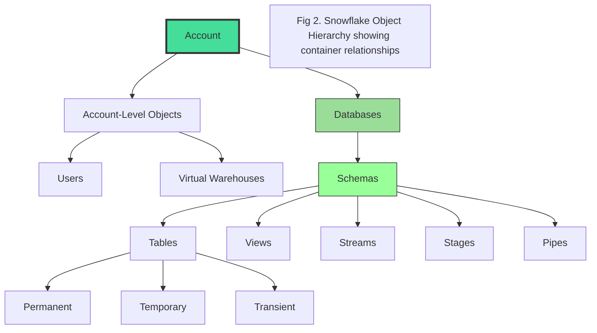
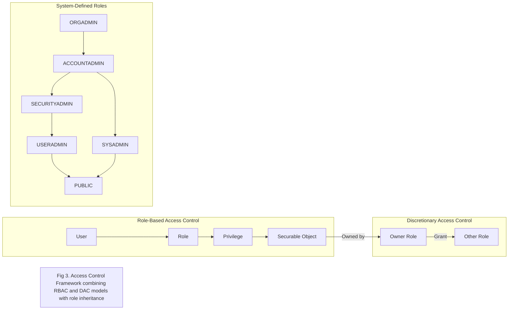

# 2. Introduction to SQL and Snowflake

## Topics
- Learn about SQL's historical context and how it fits into the modern data landscape.
- Have a crash course on Snowflake, the cloud-native data platform we'll be using for the course.
- Have an introduction to the technical aspects of the SQL language.
- Additional database concepts like the object model and access control.

## Key Takeaways

## Key Concepts from Lectures 10-12

### 1. SQL Language Anatomy

SQL (Structured Query Language) is a declarative programming language, meaning you describe *what* you want to achieve rather than *how* to achieve it. In Snowflake, SQL is central to both account management and data lifecycle operations.

A complete SQL instruction is referred to as a **statement** or **command**, terminated by a semicolon. Statements are composed of one or more **clauses**, each specifying a particular action.

*   **Clauses**:
    *   `SELECT`: Specifies which columns to retrieve from a table. The selection of columns is known as a **projection**.
    *   `FROM`: Specifies the table(s) from which to retrieve data.
    *   `WHERE`: Filters rows based on a specified condition, often called a **predicate**.

*   **Expressions**: Combinations of one or more values, operands, and operators that produce a result.
    *   **Operands**: Represent values or objects within an expression.
    *   **Operators**: Symbols (e.g., `+`, `-`, `=`, `>`) that specify an action to produce a result from operands.

**SQL Standards (ANSI, ISO, IEC)**
Snowflake broadly supports ANSI standard SQL, which is based on standards developed by the International Organization for Standardization (ISO) and the International Electrotechnical Commission (IEC). These standards ensure cross-database compatibility for core SQL features, though Snowflake also includes its own vendor-specific enhancements.

**SQL Statement Classes (ISO/IEC Categorization)**
The SQL standard categorizes statements into broad classes:

*   **SQL Schema Statements (formerly Data Definition Language - DDL)**: Used to create, alter, and drop schemas and schema objects (e.g., `CREATE TABLE`, `ALTER DATABASE`, `DROP VIEW`).
*   **SQL Data Statements (formerly Data Manipulation Language - DML and Data Query Language - DQL)**: Used for querying and manipulating data within tables (e.g., `SELECT`, `INSERT`, `UPDATE`, `DELETE`).
*   **SQL Transaction Statements (formerly Transaction Control Language - TCL)**: Used for managing transactions (e.g., `BEGIN TRANSACTION`, `COMMIT`, `ROLLBACK`).
*   **Data Control Language (DCL)**: Deals with access control, including granting and revoking privileges (e.g., `GRANT`, `REVOKE`).

%%% DIAGRAM 2: SQL Statement Categories (DDL, DML, DQL, TCL, DCL) %%%

### 2. Snowflake Object Model Hierarchy

An **object** in Snowflake is any entity you can interact with via SQL commands (e.g., `CREATE TABLE`, `DROP WAREHOUSE`). Snowflake objects are organized in a hierarchical structure:

*   **Account**: The top-level entity, representing your Snowflake service instance. It contains account-level parameters and objects.
*   **Account-Level Objects**: Objects that configure various parts of your account but typically do not hold data.
    *   **Users**: Entities representing individuals or applications that connect to Snowflake.
    *   **Virtual Warehouses**: Compute clusters used for query processing.
*   **Databases**: The primary organizational unit for data storage. Data is typically split across databases based on business, technical, security, or regulatory needs.
*   **Schemas**: Logical containers or namespaces within a database, used to organize related tables, views, and other database objects. One schema belongs to one database.
*   **Schema Objects**: Various types of objects residing within a schema.
    *   **Tables**: The logical representation of stored data, the most frequently interacted-with object.
        *   **Permanent Tables**: Persist until explicitly dropped; utilize Snowflake's data recovery features.
        *   **Temporary Tables**: Persist only for the duration of a session; used for non-permanent, transitory data.
        *   **Transient Tables**: Similar to permanent tables (exist until dropped) but do not utilize Snowflake's data recovery features, offering cost savings for non-critical data.
    *   **Views**: Stored `SELECT` statements that can be shared and queried like tables.
    *   **Streams, Stages, Pipes**: Snowflake-specific objects enabling advanced features like change data capture, data loading, and continuous data pipelines.

### 3. Access Control Framework

Snowflake employs a robust access control framework combining **Role-Based Access Control (RBAC)** and **Discretionary Access Control (DAC)**. This framework dictates who can perform what operations on which objects.

*   **Role-Based Access Control (RBAC)**:
    *   Access privileges (e.g., `SELECT`, `MODIFY`, `DELETE`) are attached to **roles**.
    *   Roles are then assigned to **users**.
    *   A user can have multiple roles and switch between them within a session.

*   **Discretionary Access Control (DAC)**:
    *   Each object has an **owner**, typically the role that created the object.
    *   The owner has full privileges on that object, including the ability to grant access to other roles or transfer ownership.
    *   Access to a securable object is denied unless explicitly allowed by a grant.

**Securable Objects**: Every object in Snowflake is securable, allowing for very granular privilege control. Access to parent objects in the hierarchy (e.g., database and schema) is often required to interact with child objects (e.g., tables).

**Roles and Privileges**:
*   **Role**: An entity to which privileges on securable objects can be granted or revoked.
*   **Privilege**: Defines the level of access a role has on a securable object. Privileges can be common across objects (e.g., `USAGE` for databases and schemas) or specific to an object (e.g., `SELECT` for tables).

**System-Defined Roles**: Snowflake accounts come with six default system-defined roles that cannot be removed or have their privileges revoked (though privileges can be added):
*   **ORGADMIN (Organization Administrator)**: Manages operations at the organization level, including account creation and region viewing.
*   **ACCOUNTADMIN (Account Administrator)**: The top-level role for an account with broad privileges, responsible for account-level parameter configuration.
*   **SYSADMIN (System Administrator)**: Manages objects within an account, with privileges to create warehouses, databases, and other objects.
*   **SECURITYADMIN (Security Administrator)**: Manages object grants globally and can create, monitor, and manage users and roles.
*   **USERADMIN (User Administrator)**: Used for user and role management, with `CREATE USER` and `CREATE ROLE` privileges.
*   **PUBLIC**: A pseudo-role automatically granted to every user and role; objects owned by `PUBLIC` are accessible to everyone.

**Role Hierarchy**: Roles can be granted to other roles, forming a hierarchy. For example, `ACCOUNTADMIN` is granted `SECURITYADMIN` and `SYSADMIN`, inheriting their abilities. Custom roles can also be created for bespoke, fine-grained security.

### 4. Terminology Distinctions

Based on the provided transcripts (Lectures 10-12), the following distinctions are implicitly or explicitly present:

*   **Statement/Command vs. Clause**: A statement is a complete instruction, while a clause is a component of a statement.
*   **Projection vs. Predicate**: Projection refers to the selection of columns (`SELECT` clause), while a predicate is the filtering condition (`WHERE` clause).
*   **Operand vs. Operator**: Operands are the values or objects in an expression, while operators are the symbols that perform actions on them.
*   **Permanent, Temporary, and Transient Tables**: These are distinct table types based on data retention and recovery features.
*   **RBAC vs. DAC**: Two different but complementary access control frameworks.
*   **Role vs. Privilege**: A role is an entity that holds privileges, and a privilege defines the level of access.

## Personal Notes

## Questions

## Navigation
[← Previous: 1. Course Setup](1-course-setup.md)  
[Next: 3. Data Definition Language (DDL) →](3-data-definition-language.md)