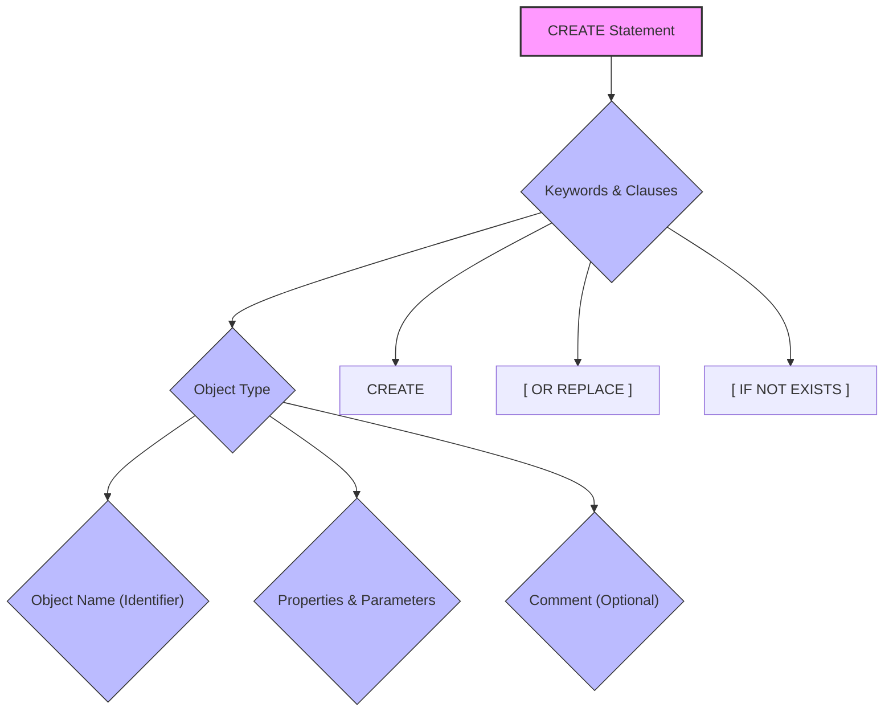
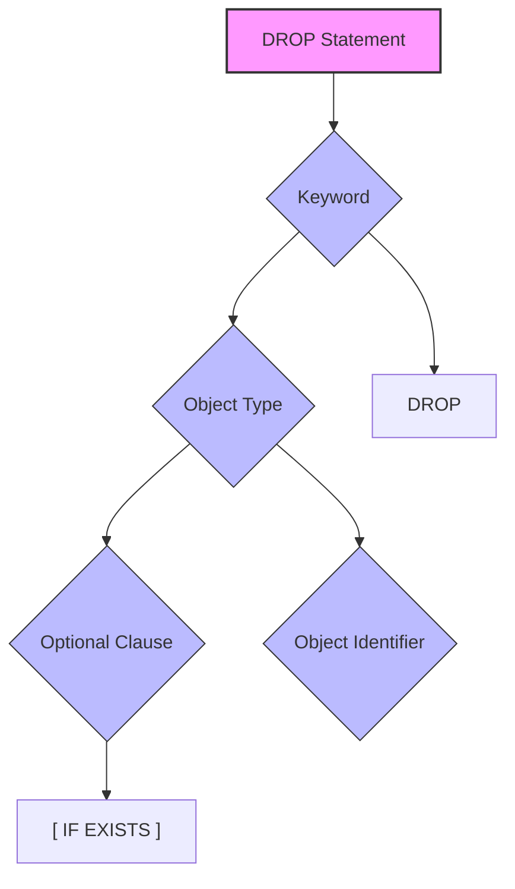

# 3. Data Definition Language (DDL)

## Topics
- Learn SQL statements used to create and modify objects: CREATE, USE, SHOW, DESCRIBE, DROP & ALTER.
- Learn about Data Types.
- Learn about Constraints.
- Have an introduction to SQL Syntax Best Practices.

## Key Takeaways
-   **DDL Commands**: `CREATE`, `USE`, `ALTER`, `SHOW`, `DESCRIBE`, and `DROP` are fundamental DDL statements for managing database objects and their metadata in Snowflake.
-   **`CREATE` Statement**: Used to instantiate new objects (warehouses, databases, schemas, tables, etc.) with specific properties and parameters. Supports `OR REPLACE` and `IF NOT EXISTS` clauses.
-   **`USE` Statement**: Essential for setting the worksheet context (active role, warehouse, database, schema) to simplify object referencing and manage permissions.
-   **`ALTER` Statement**: Modifies existing objects by changing their properties or parameters. Parameters can be set at account, session, or object levels, with a clear hierarchy of precedence.
-   **`SHOW` and `DESCRIBE` Statements**: Administrative commands for retrieving metadata about objects. `SHOW` lists objects (plural), while `DESCRIBE` provides detailed schema/metadata for a single object. Both are metadata-only operations and do not require a running warehouse.
-   **`DROP` and `UNDROP` Statements**: `DROP` removes objects. While often permanent, Snowflake's `UNDROP` command allows recovery for databases, schemas, tables, and tags within the `DATA_RETENTION_TIME_IN_DAYS` period.
-   **Data Types**: Define the structure and permissible values for columns, enabling efficient storage and specific operations. Snowflake supports Numeric, String/Binary, Logical, Date/Time, Semi-structured, and Geospatial types, often with synonyms for portability.
-   **Constraints**: Rules that restrict data. In Snowflake, only `NOT NULL` is enforced; `PRIMARY KEY`, `UNIQUE`, and `FOREIGN KEY` are for compatibility and metadata purposes, not enforcement.
-   **SQL Syntax Best Practices**: Adhering to conventions for capitalization, indentation, naming, and commenting improves code readability, maintainability, and consistency.

## Key Concepts

### 1. CREATE Statement

The `CREATE` statement is a fundamental Data Definition Language (DDL) command used to instantiate a named version of an object in Snowflake. It allows you to define and configure various objects, from data storage entities like tables to administrative objects like users and virtual warehouses.

The `CREATE` statement is part of the **CRUD** (Create, Read, Update, Delete) operations, which describe the basic operations of a persistent data store. In SQL, `CREATE` and `INSERT` statements fulfill the "Create" portion.

#### Generic Syntax

The generic syntax for the `CREATE` statement serves as a blueprint, outlining the various ways a statement can be configured.



**Fig 1. Generic Syntax of the CREATE Statement**

**Key Components:**

*   **`CREATE` Keyword**: Initiates the statement.
*   **`OR REPLACE` Clause (Optional)**: If included, this clause allows you to effectively recreate an existing object with the same name. If `OR REPLACE` is omitted and an object with the same name already exists, the statement will typically fail (with some exceptions). `OR REPLACE` and `IF NOT EXISTS` cannot be used together in the same statement.
*   **`IF NOT EXISTS` Clause (Optional)**: Prevents an error from being returned if an object with the same name already exists. Instead, it returns a status indicating "object already exists" and "statement succeeded." This is useful for automating SQL statements. `OR REPLACE` and `IF NOT EXISTS` cannot be used together in the same statement.
*   **Object Type**: Specifies the type of object being created (e.g., `TABLE`, `DATABASE`, `WAREHOUSE`, `USER`). The object type determines the specific properties and parameters that can be set for it.
*   **Object Name (Identifier)**: The unique name given to the object. Identifiers in Snowflake can be up to 255 characters long. Uniqueness requirements vary by context:
    *   Account-level objects (e.g., users, databases) must be unique across the entire account.
    *   Schema-level objects (e.g., tables) only need to be unique within their respective database.
    *   Other identifiers include column names and aliases.
*   **Properties & Parameters**: These configure the object being created. They vary widely depending on the object type (e.g., setting the size of a virtual warehouse, retention time for a table). They usually follow a `property_name = value` format.
*   **Comment (Optional)**: Metadata used to describe the object in plain text, providing an indication of its purpose to other users.

The statement is terminated with a semicolon (`;`).

#### Creating Account-Level Objects

Account-level objects in Snowflake exist outside of databases and typically require elevated permissions (e.g., `SYSADMIN` role) to create and manage. Examples include Users and Virtual Warehouses.

**Virtual Warehouses**

Virtual warehouses are compute clusters essential for processing queries in Snowflake. They are not ANSI standard SQL objects, being specific to Snowflake's architecture.

```sql
USE ROLE SYSADMIN;

CREATE WAREHOUSE XSMALL_WAREHOUSE
WAREHOUSE_SIZE = XSMALL
INITIALLY_SUSPENDED = TRUE
AUTO_RESUME = TRUE
COMMENT = 'My first extra small virtual warehouse.';
```

**Explanation of Properties:**

*   **`WAREHOUSE_SIZE`**: Determines the compute power of the virtual warehouse. Options range from `XSMALL` (smallest/cheapest) to `X6LARGE`, with each size doubling in power and cost.
*   **`INITIALLY_SUSPENDED`**: A boolean (`TRUE`/`FALSE`) that dictates whether the warehouse starts in a suspended state (not consuming credits) or a started state.
*   **`AUTO_RESUME`**: A boolean (`TRUE`/`FALSE`) that determines if the warehouse automatically resumes from a suspended state when a query is issued to it.
*   **`COMMENT`**: An optional string to describe the warehouse's purpose.

**Metadata-Only Operations:**
`CREATE` statements, along with other DDL commands, are considered "metadata-only operations" in Snowflake. This means they do not require a running virtual warehouse to execute because they only interact with Snowflake's metadata cache in the services layer, not with actual data.

#### Creating Database and Schema Objects

**Databases**

Databases are the primary logical containers for grouping data, often based on dimensions like environment or business unit. The `CREATE DATABASE` statement is straightforward.

```sql
CREATE DATABASE DEMO_DB COMMENT = 'My first database for demonstration purposes.';
```

**Schemas**

Schemas are logical containers within a database, used to further subgroup database objects like tables and views. Every database comes with default schemas (`INFORMATION_SCHEMA` for metadata and `PUBLIC` for general-purpose access).

```sql
CREATE SCHEMA DEMO_SCHEMA COMMENT = 'My first schema for demonstration purposes.';
```

### 2. USE Statement and Worksheet Context

The **worksheet context** in Snowflake defines the active environment settings for subsequent SQL statements. It comprises the currently active:
*   **Role**: Determines access control privileges.
*   **Virtual Warehouse**: Specifies the compute resource for query processing.
*   **Database**: The active database.
*   **Schema**: The active schema within the database.

The combination of the active database and schema is referred to as the **namespace**.

If no active namespace is set, SQL statements must use **fully qualified identifiers** (e.g., `<database_name>.<schema_name>.<table_name>`) to explicitly reference objects. Once a namespace is set, fully qualified identifiers are no longer strictly necessary for objects within that namespace.

The `USE` command is used to set the worksheet context via SQL.

**Syntax:**

```sql
USE <object_type> <object_identifier>;
```

**Examples:**

```sql
-- Set active role
USE ROLE SYSADMIN;

-- Set active virtual warehouse
USE WAREHOUSE XSMALL_WAREHOUSE;

-- Set active database (two ways)
USE DATABASE SNOWFLAKE_SAMPLE_DATA;
USE SNOWFLAKE_SAMPLE_DATA; -- Shorthand

-- Set active schema (two ways)
USE SCHEMA TPCH_SF100;
USE SCHEMA SNOWFLAKE_SAMPLE_DATA.TPCH_SF100; -- Fully qualified
```

## Data Types

Data types are attributes that define the structure and permissible values within database table columns. They enforce rules on the data stored and determine what operations can be performed on that data. Data types also govern the types of values that parameters and options can accept (e.g., boolean for `AUTO_RESUME`).

While each SQL standard version provides a list of expected data types, database vendors often have their own implementations and naming conventions. Snowflake supports multiple names for the same functionality, covering SQL standards and syntax from various systems like Oracle and MySQL, to simplify migration.

Snowflake categorizes all accepted data types into six main categories:

1.  **Numeric Data Types**: For storing numbers (e.g., `INTEGER`, `NUMBER`).
2.  **String and Binary Data Types**: For storing text and binary data (e.g., `VARCHAR`, `TEXT`, `BINARY`).
3.  **Logical Data Types**: For boolean values (e.g., `BOOLEAN`).
4.  **Date and Time Data Types**: For storing dates, times, and timestamps (e.g., `DATE`, `TIME`, `TIMESTAMP`).
5.  **Semi-structured Data Types**: For storing semi-structured data formats (e.g., `ARRAY`, `OBJECT`, `VARIANT`).
6.  **Geospatial Data Types**: For storing geographical data (e.g., `GEOGRAPHY`, `GEOMETRY`).

In the following sections, we will explore examples within each category.

### Numeric Data Types

Numeric data types are used to store numerical values, including integers and fractions, both positive and negative.

### String and Binary Data Types

String data types are used to store sequences of characters, such as names, addresses, or free-form text. Binary data types store sequences of uninterpreted bytes.

### Logical Data Types

Logical data types represent truth values. In Snowflake, the primary logical data type is `BOOLEAN`.

### Date and Time Data Types

Date and time data types are used to store temporal data in a standardized format, which is crucial for efficient storage and enables the use of Snowflake's built-in date and time functions for analysis and transformation.

### Semi-structured Data Types

Semi-structured data formats (e.g., JSON, XML, Avro, Parquet, ORC) are characterized by flexible schemas, nested structures, and collections (like arrays). Historically, these have been challenging to store in rigid SQL table structures. Snowflake extends standard SQL to natively support these formats.

### Geospatial Data Types

Geospatial data types are used to store geographical information, representing locations and features on Earth.

#### GEOGRAPHY

The `GEOGRAPHY` data type represents geographical features on a perfect 3D sphere (the Earth). It uses **longitude** (east-west position, -180 to 180 degrees) and **latitude** (north-south position, -90 to 90 degrees, with 0 at the equator) to define points and more complex shapes.

**Input Formats:**
The `GEOGRAPHY` data type accepts a range of standardized geospatial formats, such as **GeoJSON**. GeoJSON structures can describe simple points (coordinates) or more complex geographic features like lines or polygons.

**Usage:**
Data stored in the `GEOGRAPHY` data type is required to use Snowflake's extensive collection of geospatial functions (e.g., `ST_DISTANCE` to find the distance between two points).

**Example (Conceptual):**

```sql
-- Assuming two GEOGRAPHY columns, Parthenon_Location and TajMahal_Location,
-- storing GeoJSON representations of their coordinates.

SELECT ST_DISTANCE(Parthenon_Location, TajMahal_Location) AS distance_in_meters;
-- Result: Distance in meters between the two points.
```

## Constraints

Constraints are rules defined on table columns or at the table level that restrict the data that can be inserted, updated, or deleted. In traditional Relational Database Management Systems (RDBMS), constraints enforce business rules and data integrity.

### 3. ALTER Statement

The `ALTER` statement is a Data Definition Language (DDL) command used to modify the metadata, properties, and parameters of existing objects in Snowflake. It applies to most objects at the account and database levels.

### 4. SHOW Statement

The `SHOW` statement is an administrative DDL command used to programmatically list objects and configurations for which the current role has permissions. It retrieves metadata from Snowflake's services layer and **does not require a running virtual warehouse**.

### 5. DESCRIBE Statement

The `DESCRIBE` statement (or its shorthand `DESC`) is an administrative DDL command used to return more detailed metadata about a *specific* object. Like `SHOW`, it **does not require a running virtual warehouse** as it views an object's metadata.

### 6. DROP Statement

The `DROP` statement is a Data Definition Language (DDL) command used to remove objects from the Snowflake system. While in many traditional SQL platforms `DROP` is an irreversible operation, Snowflake offers a recovery mechanism for certain objects.

#### Generic Syntax



**Key Components and Clauses:**

*   **`DROP` Keyword**: Initiates the statement.
*   **Object Type**: Specifies the type of object to remove (e.g., `TABLE`, `DATABASE`, `SCHEMA`, `WAREHOUSE`, `USER`).
*   **`IF EXISTS` (Optional)**: Suppresses an error if the target object does not exist. Instead, it returns a success status, which is useful for automation scripts.
*   **Object Identifier**: The name of the specific object to drop.

#### Behavior of `DROP` in Snowflake

For most objects (e.g., `USER`, `WAREHOUSE`), executing a `DROP` command permanently removes the object and its configurations, making it unrecoverable. The object's identifier becomes available for reuse.

However, for a few key objects, Snowflake provides a complementary `UNDROP` command, allowing for recovery within a specific time window.

#### `UNDROP` Command (Snowflake-Specific)

The `UNDROP` command allows you to restore a dropped object to its state prior to being dropped. This functionality is available for:

*   **`DATABASE`**
*   **`SCHEMA`**
*   **`TABLE`**
*   **`TAG`**

**Syntax:**

```sql
UNDROP <object_type> <object_identifier>;
```

**Data Retention for `UNDROP`:**
The period during which an object can be `UNDROP`ped is determined by the `DATA_RETENTION_TIME_IN_DAYS` parameter. This is an object parameter that can be set at the account, database, schema, or table level. A higher retention time allows for longer recovery but incurs greater storage costs.

**Example:** If a database has a `DATA_RETENTION_TIME_IN_DAYS` of 5, it can be `UNDROP`ped within 5 days of being dropped.

#### Examples

```sql
USE ROLE SYSADMIN;
USE SCHEMA DEMO_DB.DEMO_SCHEMA;
USE WAREHOUSE XSMALL_WAREHOUSE;

-- Drop a table
DROP TABLE EMPLOYEE;

-- Drop a table if it exists (suppresses error if not found)
DROP TABLE IF EXISTS EMPLOYEE;

-- Drop a database
DROP DATABASE IF EXISTS DEMO_DB;

-- UNDROP a database
UNDROP DATABASE DEMO_DB;

-- UNDROP a table (requires its parent database and schema to exist)
USE SCHEMA DEMO_DB.DEMO_SCHEMA; -- Ensure context is set
UNDROP TABLE EMPLOYEE;

-- Dropping multiple unrequired tables
DROP TABLE EMPLOYEE_US;
DROP TABLE EMPLOYEE_DEV;
DROP TABLE EMPLOYEE_CLONE;
```

**Important Note on Order of Operations:**
When dropping or undropping hierarchical objects (like databases, schemas, tables), the order matters. For example, you cannot `UNDROP` a table if its parent database or schema does not exist. You must `UNDROP` the parent objects first.

## SQL Syntax Best Practices

While there's no single universally agreed-upon SQL style guide, certain conventions have emerged to improve code readability and maintainability. These are guidelines, not strict requirements, and should be applied with best judgment.

#### 1. Capitalization

*   **System Reserved Words**: Consistently capitalize SQL keywords (e.g., `SELECT`, `FROM`, `WHERE`, `CREATE`, `TABLE`, `ALTER`, `DATABASE`, `USE`, `SHOW`, `DESCRIBE`, `DROP`). This differentiates them from user-defined object and column names.
*   **Object and Column Names**: Use lowercase for object identifiers (e.g., table names, column names). This helps avoid potential conflicts with case sensitivity on different operating systems and platforms.

#### 2. Indentation and Spacing

*   **Clause Structure**: Each root keyword of a clause should typically occupy its own line.
*   **Indentation**: The remaining parts of a clause should be indented on subsequent lines.
*   **Column Listing**: For `SELECT` clauses, specify each column on a new line for clarity.
*   **Operators**: Use consistent spacing around operators (e.g., ` = `, ` > `, ` + `). A single space is a common convention.

#### 3. Naming Conventions

*   **Descriptive Names**: Use full-length, descriptive names for objects and columns instead of CamelCase, abbreviations, or acronyms.
*   **Lowercase with Underscores**: For multi-word names, use lowercase with words separated by underscores (e.g., `employee_id`, `first_name`).
*   **Table Identifiers**: Prefer singular nouns for table names (e.g., `employee` instead of `employees`).
*   **Starting Characters**: Object identifiers should begin with a letter.
*   **Ending Characters**: Avoid ending object identifiers with an underscore.
*   **Allowed Characters**: Only use letters, numbers, and underscores in object names.

#### 4. Commenting

Comments are essential for explaining complex logic or providing context within SQL code.

*   **Single-Line Comments**: Use two hyphens (`--`) at the beginning of the line.
    ```sql
    -- This is a single-line comment
    SELECT * FROM my_table;
    ```
*   **Multi-Line Comments**: Start with `/*` and end with `*/`.
    ```sql
    /*
    This is a multi-line comment.
    It can span across several lines.
    */
    CREATE TABLE my_table (
        id INTEGER
    );
    ```

By implementing most of these conventions, SQL code becomes significantly easier to read, understand, and maintain.

## Terminology Distinctions

Throughout this section, several terms with similar or related meanings have been discussed. Understanding their precise differences is crucial for accurate SQL development:

*   **`NUMBER` (Fixed-Point) vs. `FLOAT` (Floating-Point)**:
    *   **`NUMBER`**: Stores exact numerical values with a defined `precision` (total digits) and `scale` (digits after decimal). Ideal for financial data where precision is paramount.
    *   **`FLOAT`**: Stores approximate numerical values with a flexible decimal point. Offers greater range (scientific notation) but can lose precision for very long numbers.

*   **`NULL` vs. Empty String (`''`) vs. Zero (`0`)**:
    *   **`NULL`**: Represents the absence of any data value. It means "unknown" or "not applicable."
    *   **Empty String (`''`)**: Represents a string with zero characters. It is a known, existing value.
    *   **Zero (`0`)**: Represents the numerical value zero. It is a known, existing value.

*   **`OR REPLACE` vs. `IF NOT EXISTS` (with `CREATE` statements)**:
    *   **`OR REPLACE`**: Recreates an object if it already exists, overwriting its definition. If the object doesn't exist, it creates it.
    *   **`IF NOT EXISTS`**: Prevents an error if an object with the same name already exists; it simply returns a success status without creating or altering the existing object.
    *   *Note*: These two clauses are mutually exclusive and cannot be used together in a single `CREATE` statement.

*   **Properties vs. Parameters (with `ALTER` statements)**:
    *   **Properties**: Attributes directly associated with a specific database object (e.g., `WAREHOUSE_SIZE` for a warehouse).
    *   **Parameters**: Account or session-level settings that control behavior across a broader scope (e.g., `DATE_INPUT_FORMAT`). Parameters can have a hierarchy (Account > User > Session > Object), where child settings override parent settings.

*   **`SHOW` vs. `DESCRIBE`**:
    *   **`SHOW`**: Used to list *multiple objects* of a specific type (e.g., `SHOW TABLES`, `SHOW USERS`). Provides high-level metadata for each object.
    *   **`DESCRIBE`**: Used to retrieve *detailed metadata* about a *single, specific object* (e.g., `DESCRIBE TABLE <table_name>` to see its schema).

*   **Enforced vs. Non-Enforced Constraints**:
    *   **Enforced Constraints**: Rules that the database system actively checks and prevents violations of (e.g., `NOT NULL` in Snowflake).
    *   **Non-Enforced Constraints**: Rules that are defined in the DDL for compatibility or metadata purposes but are *not* actively checked by the database system (e.g., `PRIMARY KEY`, `UNIQUE`, `FOREIGN KEY` in Snowflake).

## Personal Notes


## Questions


[← Previous: 2. Introduction to SQL and Snowflake](2-introduction-sql-snowflake.md)
[Next: 4. Data Manipulation Language (DML) →](4-data-manipulation-language.md)
