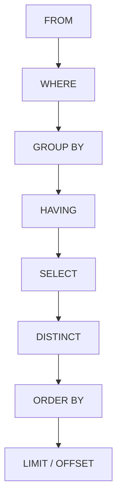
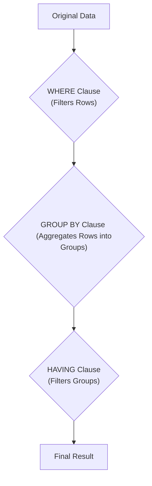

# 5 - Querying Data in SQL/Snowflake

This document provides a comprehensive reference for querying data using SQL, with a focus on Snowflake-specific functionalities where applicable. Understanding the logical processing order of SQL clauses is crucial for writing efficient and accurate queries.

## 1. Introduction to the `SELECT` Statement

The `SELECT` statement is fundamental to retrieving data from a database. While it often includes a `FROM` clause to specify the data source, the `SELECT` clause itself is the only mandatory component. It defines the data to be returned in the query's result set, which is a non-persistent, tabular output.

The `SELECT` clause can project various types of values:

*   **Literals**: Fixed values such as numbers, strings, or dates.
*   **Expressions**: Combinations of literals, column values, operators, and functions that evaluate to a single value.
*   **Built-in Function Calls**: Functions provided by the database system (e.g., `ROUND()`, `CURRENT_USER()`).
*   **User-Defined Functions (UDFs)**: Custom functions created by users.

Multiple columns can be derived in a single result set by separating each literal, expression, or function call with commas. A key benefit of using only the `SELECT` clause (without `FROM`) is that it does not require an active schema and database namespace, making it useful for quick calculations or testing functions.

### Aliases

Aliases allow you to conveniently rename columns or expressions in the output for improved readability. This is done by including a string after your column or expression, optionally using the `AS` keyword.

**Example:**

```sql
SELECT
    TITLE AS MOVIE_TITLE,
    'US' AS RELEASE_COUNTRY,
    ROUND(RATING * 10) || '%' AS RATING_PERCENTAGE
FROM
    MOVIE;
```

## 2. Logical Query Processing Order

Understanding the logical order in which SQL clauses are processed is critical, as it dictates how data is filtered, grouped, and transformed. This order is often different from the syntactic order in which you write the query.

Here is the logical processing order for a typical `SELECT` statement:



**Explanation of Order:**

1.  **`FROM`**: Determines the initial set of rows from the specified tables or data sources.
2.  **`WHERE`**: Filters individual rows based on specified conditions. This happens *before* any grouping.
3.  **`GROUP BY`**: Groups the filtered rows into summary rows based on common values in specified columns.
4.  **`HAVING`**: Filters the *groups* created by the `GROUP BY` clause based on aggregate conditions.
5.  **`SELECT`**: Specifies which columns or expressions will be included in the final result set. This is where aggregate functions are often defined.
6.  **`DISTINCT`**: Removes duplicate rows from the result set.
7.  **`ORDER BY`**: Sorts the final result set based on specified columns or expressions.
8.  **`LIMIT` / `OFFSET`**: Restricts the number of rows returned and specifies a starting point for retrieval.

## 3. `FROM` Clause

The `FROM` clause specifies the source object(s) from which data will be retrieved. The most common source is a single database table. However, Snowflake supports various other data sources:

*   **Single Database Table**: The most basic form.
*   **Joins**: Combining data from multiple tables based on common keys.
*   **Subqueries (Derived Tables)**: Non-persistent sets of rows held in memory.
*   **Views (Virtual Tables)**: Stored query definitions, not actual data.
*   **Tabular Functions**: Functions that return a set of rows.
*   **Files in Stage Objects**: Reading data directly from files stored in Snowflake stages.

### Basic `FROM` Clause Usage

**Selecting a single column:**

```sql
SELECT
    TITLE
FROM
    MOVIE;
```

**Selecting multiple columns:**

```sql
SELECT
    MOVIE_ID,
    TITLE,
    RELEASE_DATE
FROM
    MOVIE;
```

**Selecting all columns (`*`):**

```sql
SELECT
    *
FROM
    MOVIE;
```

**Selecting all columns excluding specific ones (`EXCLUDE` - Snowflake specific):**

```sql
SELECT
    * EXCLUDE GENRE
FROM
    MOVIE;
```

### `DISTINCT` Keyword

The `DISTINCT` keyword, used within the `SELECT` clause, returns only the unique values of the specified column(s).

**Example (Distinct Genres):**

```sql
SELECT
    DISTINCT GENRE
FROM
    MOVIE;
```

**Example (Distinct Combinations):**

```sql
SELECT
    DISTINCT GENRE, RATING
FROM
    MOVIE;
```

### `LIMIT` and `OFFSET`

These clauses are used to constrain the number of rows a query will output and to specify a starting point.

*   **`LIMIT`**: Restricts the maximum number of rows returned.
*   **`OFFSET`**: Specifies how many rows to skip from the beginning of the result set before starting to return rows.

**Example (`LIMIT`):**

```sql
SELECT
    *
FROM
    MOVIE
LIMIT
    10;
```

**Example (`LIMIT` with `OFFSET`):**

```sql
SELECT
    *
FROM
    MOVIE
LIMIT
    10
OFFSET
    5;
```

## 4. `WHERE` Clause

The `WHERE` clause is used to filter individual rows in a query's result set based on one or more conditions (predicates). Each row is evaluated against the condition(s), and only those that evaluate to `TRUE` are included in the output. The `WHERE` clause is applied *before* any grouping or aggregation.

### Comparison Operators

Comparison operators are used to compare two values, resulting in a Boolean (`TRUE`/`FALSE`) outcome.

| Operator | Description | Example |
|----------|-------------|---------|
| `=`      | Equal to    | `RATING = 8` |
| `!=` or `<>` | Not equal to | `GENRE <> 'Comedy'` |
| `>`      | Greater than | `RATING > 8` |
| `>=`     | Greater than or equal to | `RATING >= 8` |
| `<`      | Less than   | `RATING < 7` |
| `<=`     | Less than or equal to | `RATING <= 8` |

**Example (Not Equal):**

```sql
SELECT
    *
FROM
    MOVIE
WHERE
    GENRE <> 'Comedy';
```

**Example (Greater Than):**

```sql
SELECT
    TITLE, GENRE, RATING
FROM
    MOVIE
WHERE
    RATING > 8;
```

### Logical Operators

Logical operators combine multiple filter conditions.

| Operator | Description |
|----------|-------------|
| `AND`    | Both conditions must be `TRUE`. |
| `OR`     | At least one condition must be `TRUE`. |
| `NOT`    | Negates the condition (reverses `TRUE` to `FALSE` and vice-versa). |

**Example (`AND`):**

```sql
SELECT
    MOVIE_ID, TITLE, GENRE, RATING
FROM
    MOVIE
WHERE
    GENRE = 'Comedy'
AND
    RATING >= 7;
```

**Example (`OR`):**

```sql
SELECT
    MOVIE_ID, TITLE, GENRE, RATING
FROM
    MOVIE
WHERE
    GENRE = 'Comedy'
OR
    RATING < 7;
```

**Example (`NOT`):**

```sql
SELECT
    TITLE, GENRE, RATING, RUNTIME AS RUNTIME_IN_MINUTES
FROM
    MOVIE
WHERE
   NOT GENRE = 'Comedy'
AND
    RUNTIME > 189;
```

### Grouping Conditions with Parentheses

Parentheses can be used to explicitly define the order of evaluation for multiple conditions, ensuring clarity and preventing unexpected results.

**Example:**

```sql
SELECT
    TITLE, GENRE, RATING, RUNTIME AS RUNTIME_IN_MINUTES
FROM
    MOVIE
WHERE
    (GENRE = 'Comedy' OR RATING < 7)
AND
    RUNTIME > 160;
```

### `LIKE` and `IN` Keywords

*   **`LIKE`**: Used for pattern matching in string columns. The `%` character acts as a wildcard for any sequence of zero or more characters.
*   **`IN`**: Tests whether a column value is a member of an explicit list of values. Can be combined with `NOT` (`NOT IN`).

**Example (`LIKE`):**

```sql
SELECT
    *
FROM
    MOVIE
WHERE
    TITLE LIKE 'The%';
```

**Example (`IN`):**

```sql
SELECT
    *
FROM
    MOVIE
WHERE
    GENRE IN ('Comedy', 'Horror', 'Drama');
```

## 5. `GROUP BY` Clause

The `GROUP BY` clause is used to aggregate rows that have the same values in specified columns into summary rows. This allows you to perform calculations (using aggregate functions) on each group.

**Common Aggregate Functions:**

*   `COUNT()`: Returns the number of rows in a group.
*   `SUM()`: Calculates the sum of values in a numeric column for each group.
*   `AVG()`: Calculates the average of values in a numeric column for each group.
*   `MIN()`: Returns the minimum value in a column for each group.
*   `MAX()`: Returns the maximum value in a column for each group.

**Example (Grouping by a single column):**

```sql
SELECT
    GENRE, COUNT(MOVIE_ID) AS MOVIE_COUNT
FROM
    MOVIE
GROUP BY
    GENRE
ORDER BY
    MOVIE_COUNT DESC;
```

**Example (Grouping on multiple columns):**

```sql
SELECT
    GENRE,
    YEAR(RELEASE_DATE) AS RELEASE_YEAR,
    COUNT(MOVIE_ID) AS MOVIE_COUNT
FROM
    MOVIE
GROUP BY
    GENRE, YEAR(RELEASE_DATE)
ORDER BY
    GENRE, YEAR(RELEASE_DATE);
```

### `ROLLUP` Functionality

The `ROLLUP` extension to `GROUP BY` generates subtotals for each level of aggregation and a grand total. It creates additional rows with `NULL` values in the grouping columns to represent these totals.

**Example (`ROLLUP`):**

```sql
SELECT
    YEAR(RELEASE_DATE) AS RELEASE_YEAR,
    GENRE,
    SUM(GROSS) AS TOTAL_GROSS
FROM
    MOVIE
GROUP BY
    ROLLUP (YEAR(RELEASE_DATE), GENRE)
ORDER BY
    YEAR(RELEASE_DATE), GENRE;
```

## 6. `HAVING` Clause

The `HAVING` clause is used to filter groups of rows that result from a `GROUP BY` clause. Unlike `WHERE`, which filters individual rows *before* grouping, `HAVING` filters the *aggregated results* of the groups. This means you can use aggregate functions directly in the `HAVING` clause.

**Example (`HAVING`):**

```sql
SELECT
    DIRECTOR_NAME,
    AVG(RATING) AS AVG_RATING
FROM
    MOVIE
GROUP BY
    DIRECTOR_NAME
HAVING
    AVG_RATING >= 8
ORDER BY
    AVG_RATING DESC;
```

### `WHERE` vs. `HAVING` Comparison

The distinction between `WHERE` and `HAVING` is a common point of confusion. It's crucial to remember their position in the logical query processing order.



**Business Logic Difference:**

Consider two queries aiming to find directors with high-rated movies:

**Query 1: Using `WHERE` Clause**

```sql
SELECT
    DIRECTOR_NAME,
    AVG(RATING) AS AVG_RATING
FROM
    MOVIE
WHERE
    RATING >= 8 -- Filters individual movies before grouping
GROUP BY
    DIRECTOR_NAME
ORDER BY
    AVG_RATING DESC;
```

*   **Business Logic**: This query first filters for only movies with a rating of 8 or higher. Then, it groups these pre-filtered movies by director and calculates the average rating *only among those highly-rated movies*. It identifies directors who have directed *any* movies rated 8+, and their average rating *among those specific movies*. This answers: "Among high-quality movies (rating ≥ 8), which directors have the highest average ratings?"

**Query 2: Using `HAVING` Clause**

```sql
SELECT
    DIRECTOR_NAME,
    AVG(RATING) AS AVG_RATING
FROM
    MOVIE
GROUP BY
    DIRECTOR_NAME
HAVING
    AVG_RATING >= 8 -- Filters groups based on the aggregate average rating
ORDER BY
    AVG_RATING DESC;
```

*   **Business Logic**: This query considers *all* movies for each director, calculates the average rating across a director's *entire filmography*, and then filters to only show directors whose *overall average rating* is 8 or higher. This identifies directors who consistently produce high-quality work across their entire filmography. This answers: "Which directors consistently produce high-quality work across their entire filmography?"

**Example Scenario:**

Imagine a director with 10 movies: 7 rated 9.0 and 3 rated 5.0. The overall average rating for this director is (7 * 9.0 + 3 * 5.0) / 10 = 7.8.

*   **`WHERE` Query**: Only the 7 high-rated movies (9.0) are considered. The average for this subset is 9.0, so the director *would* appear in the results.
*   **`HAVING` Query**: All 10 movies are averaged (7.8). Since 7.8 is less than 8, the director would *not* appear in the results of this query.

The choice depends on whether you're interested in identifying directors who can make excellent movies (`WHERE`) or directors who consistently make good movies overall (`HAVING`).

### Combining `WHERE` and `HAVING`

It is common and often necessary to use both `WHERE` and `HAVING` in a single query. `WHERE` filters the individual rows before grouping, and `HAVING` filters the groups after aggregation.

**Example:**

```sql
SELECT
    DIRECTOR_NAME,
    SUM(GROSS) AS TOTAL_GROSS
FROM
    MOVIE
WHERE
    GENRE = 'Action' -- Filters individual rows (only Action movies are considered)
GROUP BY
    DIRECTOR_NAME
HAVING
    SUM(GROSS) > 1000 -- Filters groups (only directors with > $1000 gross from Action movies)
ORDER BY
    TOTAL_GROSS DESC;
```

## 7. `SELECT` Clause (Post-Aggregation)

After `FROM`, `WHERE`, `GROUP BY`, and `HAVING` have been processed, the `SELECT` clause determines the final columns and expressions to be displayed. At this stage, you can select:

*   Grouping columns (from `GROUP BY`).
*   Aggregate functions applied to non-grouping columns.
*   Expressions involving grouping columns or aggregate functions.

## 8. `ORDER BY` Clause

The `ORDER BY` clause is used to sort the final result set of a query. By default, rows returned by a query are not in any particular order. Sorting is applied *after* all other filtering and aggregation operations.

### Sorting Order

*   **Ascending (`ASC`)**: Sorts from smallest to largest (A-Z for strings, lowest to highest for numbers, oldest to newest for dates). This is the default behavior.
*   **Descending (`DESC`)**: Sorts from largest to smallest (Z-A for strings, highest to lowest for numbers, newest to oldest for dates).

**Example (Ascending by Director Name):**

```sql
SELECT
    DIRECTOR_NAME, RUNTIME
FROM
    MOVIE
WHERE
    RUNTIME >= 170
ORDER BY
    DIRECTOR_NAME ASC;
```

**Example (Descending by Release Date):**

```sql
SELECT
    DIRECTOR_NAME, RELEASE_DATE
FROM
    MOVIE
WHERE
    RUNTIME >= 170
ORDER BY
    RELEASE_DATE DESC;
```

### Sorting by Column Position

You can also sort by the numerical position of a column in the `SELECT` list.

**Example (Sorting by first column):**

```sql
SELECT
    DIRECTOR_NAME, RUNTIME
FROM
    MOVIE
WHERE
    RUNTIME >= 170
ORDER BY
    1; -- Sorts by DIRECTOR_NAME (first column in SELECT)
```

### Handling `NULL` Values

By default, Snowflake considers `NULL` values to be higher than non-`NULL` values.

*   In `ASC` order, `NULL`s appear at the end.
*   In `DESC` order, `NULL`s appear at the beginning.

You can explicitly control the placement of `NULL`s using `NULLS FIRST` or `NULLS LAST`.

**Example (`NULLS FIRST`):**

```sql
SELECT DISTINCT
    GENRE
FROM
    MOVIE
ORDER BY
    GENRE NULLS FIRST;
```

**Example (`NULLS LAST` with `DESC`):**

```sql
SELECT DISTINCT
    GENRE
FROM
    MOVIE
ORDER BY
    GENRE DESC NULLS LAST;